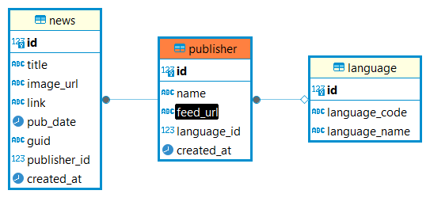

# News Aggregator Backend

Backend for news aggregator app

## Pre-requisite

- Node.js (I use version 18. Haven't tested with other versions)

## Installation and Database Setup

1. Clone the project and then install the necessary dependencies, run the following command at the root directory:

```bash
npm install
```

2. Create an `.env` file from the `.env.example`. Fill in your DB username and password in the `DB_DEV_USER` and `DB_DEV_PASSWORD` variables.

3. Run the following commands for the migration and and seeding.

```bash
npm run migration
npm run seed
```

4. Finally, to start the development server, run:

```bash
npm run dev
```

## Database ERD



## Endpoints

1.`http://localhost:8000/api/publishers` - Returns a list of all publishers saved in database.

Method: `GET`

Sample response:

```json
{
	"publishers": [
		{
			"id": 2,
			"name": "Berita Harian",
			"feedUrl": "https://bharian.com.my/terkini.xml",
			"languageCode": "ms",
			"languageName": "Bahasa Malaysia"
		},
		{
			"id": 3,
			"name": "SAYS",
			"feedUrl": "https://says.com/my/rss",
			"languageCode": "en",
			"languageName": "English"
		},
		{
			"id": 1,
			"name": "Utusan Malaysia",
			"feedUrl": "https://www.utusan.com.my/feed",
			"languageCode": "ms",
			"languageName": "Bahasa Malaysia"
		}
	]
}
```

2.`http://localhost:8000/api/news/` - Returns article feed from the database in descending order of the published date.

Method: `GET`

Query parameter is used to filter the feed by language. E.g. `http://localhost:8000/api/news?language=ms` to filter by Bahasa Melayu. For now, only English (`en`) and Bahasa Melayu (`ms`) is available

Sample response:

```json
{
	"news": [
		{
			"id": 702,
			"title": "Nas-T Sah Jadi Watak Utama Dalam Filem 'Keluang Man', Berjaya Lepas Hantar Video Ujibakat",
			"imageUrl": "https://images.says.com/uploads/story/cover_image/66054/thumb_e7d5.jpg",
			"link": "https://says.com/my/seismik/nas-t-sah-jadi-watak-utama-dalam-filem-keluang-man-berjaya-lepas-hantar-video-ujibakat",
			"pubDate": "2023-11-28T14:55:33.000Z",
			"name": "SAYS"
		},
		{
			"id": 706,
			"title": "\"Penyakit Ain ProMax\" - Parodi Lelaki Murung Sebab Nak Kahwin Lain Ini Buat Ramai Terhibur",
			"imageUrl": "https://images.says.com/uploads/story/cover_image/66051/thumb_4064.jpg",
			"link": "https://says.com/my/seismik/penyakit-ain-promax-parodi-lelaki-murung-sebab-nak-kahwin-lain-ini-buat-ramai-terhibur",
			"pubDate": "2023-11-28T10:09:49.000Z",
			"name": "SAYS"
		},
    ...
	]
}
```

3.`http://localhost:8000/api/news/crawl-articles` - Endpoint to crawl and parsed the rss feeds. Return status code `200` on success. The cron job will call this endpoint to initiate the article crawling on the background

Method: `GET`

### Cron Job

[`node-cron`](https://www.npmjs.com/package/node-cron) library is used to create the cron job. The cron job logic is in the `/src/jobs/crawl-article.job.ts` file.

On each run, the cron job will call the `http://localhost:8000/api/news/crawl-articles` endpoint. It is set to run hourly.

To test the cron job, you can change the frequency value specified in `CRAWL_ARTICLES_CRON_JOB_SCHEDULE` variable. E.g. to change it to run every 3 minutes, use this: `*/3 * * * *`
